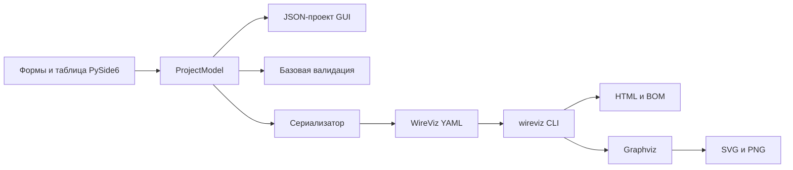

# WireWizardGUI

WireWizardGUI — настольный прототип редактора кабельных сборок и жгутов поверх
[WireViz](https://github.com/wireviz/WireViz). Приложение позволяет описать
разъёмы, кабели, наконечники и связи между ними через обычные формы и таблицу,
после чего получить YAML в синтаксисе WireViz, предварительный SVG и выходные
файлы WireViz.

Проект рассчитан на тех, кому удобнее собирать описание жгута в GUI, чем писать
YAML вручную: разработчиков электроники, инженеров, сборщиков прототипов и
авторов производственной документации.

> [!IMPORTANT]
> Это не графический CAD и не полноценный редактор всего формата WireViz.
> WireWizardGUI редактирует поддерживаемую модель проекта, а схему рисует
> внешний WireViz с помощью Graphviz. Импорт и повторный экспорт произвольного
> WireViz YAML может потерять неподдерживаемые поля.

## Возможности

- создание и редактирование проекта жгута;
- разъёмы с типом, подтипом, числом и обозначениями контактов, метками, цветом и
  примечаниями;
- кабели и жгуты с сечением, длиной, числом жил, цветами, метками, экраном и
  категорией `bundle`;
- обжимные и двойные наконечники (`ferrules`);
- табличный редактор маршрутов соединений длиной до семи элементов;
- параллельные группы контактов и жил, именованные контакты и подключение экрана;
- мастер последовательной разводки нескольких разъёмов (`Daisy-chain`);
- базовая проверка проекта до передачи в WireViz;
- доступный только для чтения предпросмотр итогового YAML;
- SVG-предпросмотр через локальные WireViz и Graphviz;
- сохранение рабочего проекта GUI в JSON;
- открытие JSON-проекта, импорт и экспорт WireViz YAML;
- запуск WireViz из приложения для создания схемы и спецификации.

При старте открывается демонстрационный жгут. Кнопка `New` создаёт пустой проект.

## Как это работает



1. Интерфейс записывает данные в Python-модель `ProjectModel`.
2. Валидатор ищет распространённые ошибки в компонентах и маршрутах.
3. Сериализатор преобразует модель в структуру WireViz и YAML.
4. JSON хранит полный рабочий проект WireWizardGUI, а YAML служит для обмена с
   WireViz.
5. Для предпросмотра приложение создаёт временный YAML, запускает команду
   `wireviz` и показывает созданный SVG через Qt.
6. `Run WireViz` сохраняет YAML в выбранный каталог и запускает WireViz там.
   Точный набор артефактов зависит от установленной версии WireViz; обычно это
   SVG, HTML, PNG и таблица BOM.

Кнопка `Refresh Preview` запускает валидацию и рендер синхронно. То же происходит
при старте и после большинства изменений структуры проекта. Поэтому долгий или
зависший WireViz может временно заморозить интерфейс. Изменения в форме также
переносятся в модель при выборе другого элемента, сохранении, экспорте или
запуске WireViz.

## Требования

- Python 3.10 или новее рекомендуется; сам код использует синтаксис Python 3.9+;
- [Graphviz](https://graphviz.org/download/) как системная программа;
- Python-зависимости из `requirements.txt`:
  - `PySide6>=6.6` — интерфейс Qt;
  - `PyYAML>=6.0` — чтение и запись YAML;
  - `Wireviz` — генератор схем и спецификаций.

Команды `wireviz` и `dot` должны быть доступны через `PATH`. Graphviz не
устанавливается автоматически вместе с Python-пакетами.

## Установка и запуск в Windows 10/11

Установите Python с [python.org](https://www.python.org/downloads/),
[Git for Windows](https://git-scm.com/download/win) и Graphviz с
[официальной страницы](https://graphviz.org/download/). При установке добавьте
Python, Git и Graphviz в `PATH`, затем откройте новый терминал. Вместо Git можно
скачать ZIP-архив репозитория на GitHub, распаковать его и продолжить с команды
`cd wirewizard_gui`.

В PowerShell из каталога, где должен находиться проект:

```powershell
git clone https://github.com/esolotin/wirewizard_gui.git
cd wirewizard_gui
python -m venv .venv
.\.venv\Scripts\Activate.ps1
python -m pip install --upgrade pip
python -m pip install -r requirements.txt
python -m wirewizard_gui.app
```

Если PowerShell запрещает запуск скрипта активации, разрешите его только для
текущего процесса и повторите активацию:

```powershell
Set-ExecutionPolicy -Scope Process -ExecutionPolicy Bypass
.\.venv\Scripts\Activate.ps1
```

В обычной командной строке `cmd.exe` вместо PowerShell-команды активации:

```bat
.venv\Scripts\activate.bat
```

Для следующих запусков достаточно:

```powershell
cd wirewizard_gui
.\.venv\Scripts\Activate.ps1
python -m wirewizard_gui.app
```

Запускайте команду из корня клона. Переходить в родительский каталог перед
`python -m wirewizard_gui.app` не нужно.

## Установка в Linux и macOS

Код не использует Windows-специфичные API, поэтому ожидается работа на Linux и
macOS, поддерживаемых PySide6. Автоматической проверки этих платформ в проекте
пока нет.

Сначала установите Graphviz:

```bash
# Ubuntu / Debian
sudo apt install graphviz

# Fedora
sudo dnf install graphviz

# macOS с Homebrew
brew install graphviz
```

Затем клонируйте и запустите проект:

```bash
git clone https://github.com/esolotin/wirewizard_gui.git
cd wirewizard_gui
python3 -m venv .venv
source .venv/bin/activate
python -m pip install --upgrade pip
python -m pip install -r requirements.txt
python -m wirewizard_gui.app
```

## Проверка установки

```text
python -m pip check
wireviz --version
dot -V
```

Если обе последние команды находятся, SVG-предпросмотр и `Run WireViz` должны
быть доступны. Редактирование, JSON и YAML работают без Graphviz, но рендер —
нет.

## Интерфейс

Главное окно состоит из трёх областей:

1. Слева — дерево проекта с группами `Connectors`, `Cables`, `Ferrules` и
   `Connections`.
2. В центре — форма выбранного компонента или таблица соединений.
3. Справа — итоговый YAML и SVG-предпросмотр.

Верхняя панель содержит действия:

- `New` — создать пустой проект;
- `Open Project` — открыть JSON-проект или YAML;
- `Import YAML` — импортировать WireViz YAML как новый проект GUI;
- `Save Project` / `Save Project As` — сохранить рабочий JSON;
- `Export YAML` — записать текущую модель в WireViz YAML;
- `Run WireViz` — создать YAML и запустить WireViz в выбранной папке;
- `Daisy-chain` — построить последовательную разводку;
- `Refresh Preview` — обновить YAML, выполнить проверки и перерисовать SVG.

Добавление, копирование и удаление компонентов доступно через контекстное меню
дерева. Новые обозначения получают первый свободный номер: `X1`, `X2` для
разъёмов, `W1`, `W2` для кабелей, `F1`, `F2` для наконечников.

## Типичный сценарий

1. Нажмите `New`, если демонстрационный проект не нужен.
2. Выберите корень дерева и задайте название и описание.
3. Через контекстное меню добавьте разъёмы, кабели и при необходимости
   наконечники.
4. Заполните свойства каждого элемента.
5. Добавьте строку соединения и откройте узел `Rows: N` либо используйте
   `Daisy-chain`.
6. Нажмите `Refresh Preview`, просмотрите YAML и исправьте предупреждения.
7. Сохраните рабочую версию через `Save Project As` в JSON.
8. Передайте описание в WireViz через `Export YAML` либо создайте все артефакты
   кнопкой `Run WireViz`.

Для вывода WireViz лучше выбирать отдельную папку: приложение записывает туда
`<имя>.yml`, а WireViz может перезаписать одноимённые артефакты без отдельного
подтверждения.

## Маршруты соединений

Внутри модели каждая строка хранится как маршрут, хотя редактируется таблицей.
Шаги разделяются `->`, индекс контакта или жилы отделяется двоеточием:

```text
X1:1 -> W1:1 -> X2:1
```

Поддерживаемые варианты:

| Назначение | Пример |
| --- | --- |
| Обычная цепь | `X1:1 -> W1:1 -> X2:1` |
| Наконечник без индекса | `X1:2 -> W1:2 -> F1 -> W2:1 -> X2:2` |
| Именованный контакт | `X1:GND -> W1:1 -> X2:GND` |
| Цвет или метка жилы | `X1:1 -> W1:RD -> X2:1` |
| Экран кабеля | `X1:1 -> W1:s` |
| Параллельная группа | `X1:[1, 2] -> W1:[1, 2] -> X2:[1, 2]` |
| Диапазон | `X1:1-4 -> W1:1-4 -> X2:1-4` |

Таблица показывает 3, 5 или 7 шагов. Пустые ячейки игнорируются. `Compact Row`
сдвигает заполненные шаги влево. Маршрут длиннее семи элементов не
поддерживается и при редактировании будет обрезан.

## Мастер Daisy-chain

Мастер доступен при наличии минимум двух разъёмов и одного кабеля.

1. Выберите разъёмы; их порядок в списке задаёт порядок цепочки.
2. Выберите существующий кабель как шаблон.
3. Укажите первый контакт и число разводимых контактов.
4. При необходимости включите обратное сопоставление на каждом втором участке.

Для `N` разъёмов мастер создаёт `N - 1` новых кабелей-копий шаблона и отдельную
строку соединения для каждого контакта каждого участка. Допустимое число
контактов ограничивается самым маленьким выбранным разъёмом и числом жил в
кабеле-шаблоне.

## Проверка проекта

`Refresh Preview` проверяет:

- повторяющиеся обозначения компонентов;
- неизвестные компоненты в маршрутах;
- чередование разъёмов и кабелей;
- контакты и жилы вне заданного диапазона;
- неизвестные пользовательские обозначения, метки и цвета;
- использование `s` у кабеля без экрана;
- разную длину параллельных групп.

Найденные проблемы добавляются комментариями в YAML-предпросмотр и выводятся
рядом с ошибкой рендера. Это предупреждения: они не блокируют сохранение,
экспорт и запуск WireViz. Проверка не заменяет полную проверку синтаксиса и
семантики самим WireViz.

## Форматы файлов

### JSON-проект WireWizardGUI

JSON — основной рабочий формат. Он хранит название, описание, все свойства
разъёмов, кабелей и наконечников, а также строки маршрутов. Используйте его для
продолжения работы в GUI.

### WireViz YAML

YAML — формат обмена и вход для WireViz. WireWizardGUI поддерживает:

- `metadata.title` и `metadata.description`;
- основные поля `connectors`;
- основные поля `cables`;
- `connections` в виде списков маршрутов.

Наконечник экспортируется в секцию `connectors` со `style: simple`. При импорте
элемент распознаётся как наконечник, только если имеет `style: simple` и его имя
начинается с `F` либо тип содержит слово `ferrule`.

> [!WARNING]
> Импорт WireViz YAML не является сохранением «один к одному». Неизвестные
> секции, шаблоны и неподдерживаемые параметры не попадают в модель и исчезнут
> при следующем экспорте. Сохраняйте исходный YAML отдельно и проверяйте diff
> перед заменой сложного файла. Полное описание формата находится в
> [документации WireViz](https://github.com/wireviz/WireViz/blob/master/docs/syntax.md).

## Структура проекта

```text
wirewizard_gui/
├── wirewizard_gui/
│   ├── app.py                 # точка входа
│   ├── domain/
│   │   ├── models.py          # модели проекта
│   │   ├── serializer.py      # JSON-модель <-> WireViz YAML
│   │   ├── validation.py      # базовые проверки
│   │   └── options.py         # предустановленные варианты полей
│   ├── services/
│   │   ├── project_service.py # чтение и запись JSON/YAML
│   │   └── wireviz_service.py # запуск внешнего wireviz
│   └── ui/
│       ├── main_window.py     # главное окно и сценарии действий
│       ├── editors/           # формы и таблица соединений
│       ├── dialogs/           # мастер Daisy-chain
│       └── panels/            # YAML- и SVG-предпросмотр
├── requirements.txt
├── README.md
└── LICENSE
```

В репозитории пока также лежит зеркальная копия `app.py`, `domain/`, `services/`
и `ui/` на верхнем уровне. Сейчас обе копии совпадают. Рекомендуемая команда
запуска из корня клона использует вложенный пакет `wirewizard_gui/`. До
рефакторинга изменения исходников нужно синхронизировать между копиями.

## Текущие ограничения

- нет свободного графического редактирования схемы: рисунок создаёт WireViz;
- поддерживается только часть синтаксиса WireViz;
- маршрут ограничен семью шагами;
- нет undo/redo, автосохранения, индикатора несохранённых изменений и
  подтверждения перед `New`, открытием или закрытием;
- переименование или удаление компонента не обновляет старые маршруты;
- предупреждения валидатора не блокируют неверный экспорт;
- рендер выполняется в UI-потоке без тайм-аута, поэтому большая или зависшая
  задача WireViz временно заморозит окно;
- SVG-предпросмотр не содержит масштабирования, панорамирования и отдельного
  экспорта;
- нет автоматических тестов, CI и устанавливаемого Python-пакета;
- набор Python-зависимостей не закреплён lock-файлом.

## Решение проблем

### `Команда 'wireviz' не найдена в PATH`

Активируйте виртуальное окружение, повторите `python -m pip install -r
requirements.txt` и проверьте `wireviz --version`.

### WireViz не находит Graphviz

Установите Graphviz отдельно, откройте новый терминал и проверьте `dot -V`. В
Windows каталог `bin` установленного Graphviz должен находиться в `PATH`.

### YAML отображается, но SVG не строится

Просмотрите текст ошибки под SVG-панелью и предупреждения в конце YAML. Затем
запустите экспортированный файл напрямую, чтобы получить полный вывод WireViz:

```text
wireviz project.yml
```

### После переименования появился `unknown component`

Маршруты не переписываются автоматически. Откройте `Connections` и вручную
замените старое обозначение компонента.

## Статус разработки

Проект — рабочий desktop-прототип. Основные сценарии создания, сохранения,
импорта, экспорта и рендера реализованы, но совместимость с полным форматом
WireViz и платформами ещё не покрыта автоматическими тестами.

## Лицензия

Проект распространяется по лицензии [GNU GPL v3](LICENSE).
